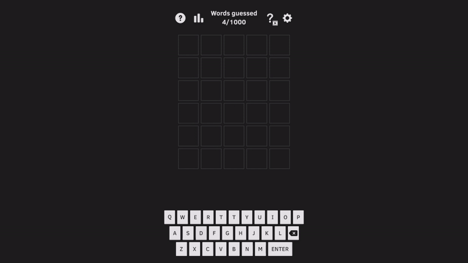

# 🟩 Wordix

**Wordix** is a Wordle-like game where players have to guess words within a limited number of attempts. The game helps improve logic, memory, and vocabulary.

## 🔗 Play on Yandex Games

👉 [Play Now](https://yandex.ru/games/app/396630?lang=en)  

## 🖼️ Gameplay

## ⚙️ Technologies

- **Unity (WebGL)**
- **C#**
- **Zenject**
- **DOTween**
- **PluginYourGames** - used for Yandex Games integration and monetization.
